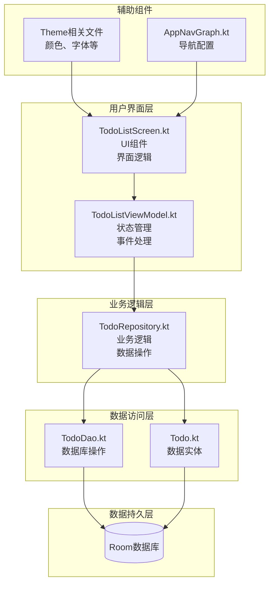
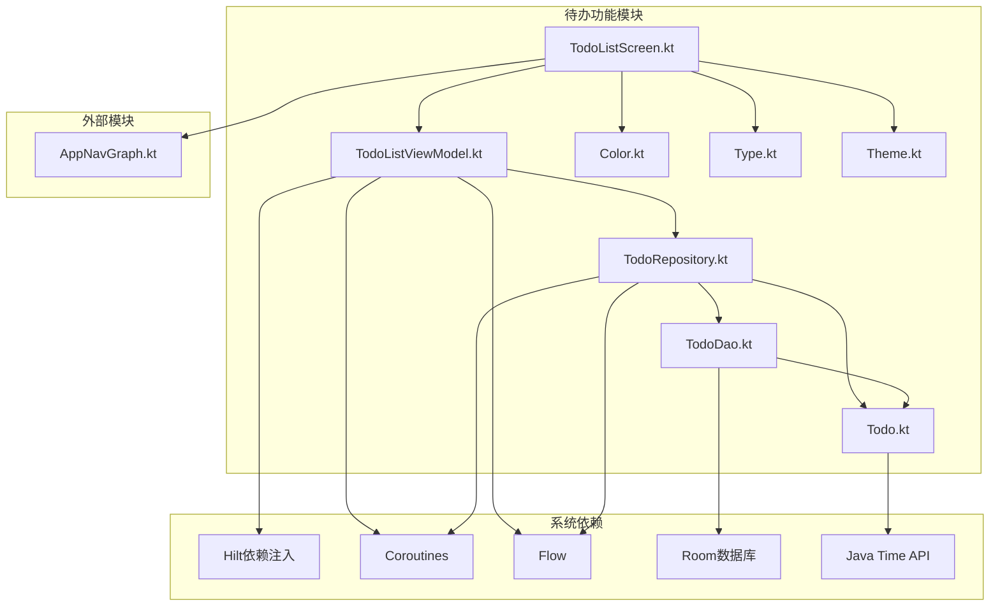
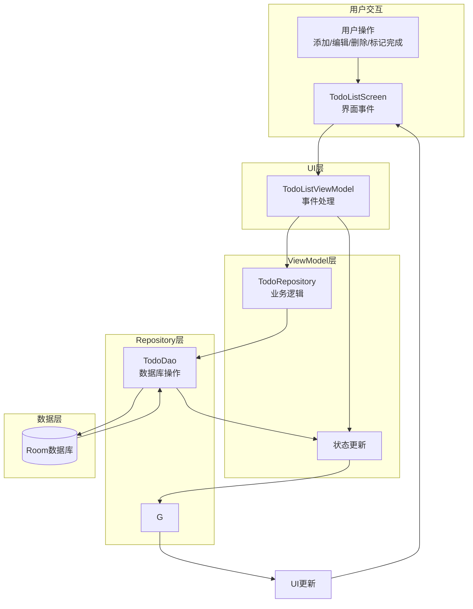

# 待办功能UI重构设计文档

## 1. 整体架构图



## 2. 分层设计和核心组件

### 分层设计
1. **用户界面层 (UI Layer)**
   - 负责展示待办事项列表和用户交互
   - 处理用户输入和界面更新
   - 组件：TodoListScreen、TodoItem、TodoDialog

2. **业务逻辑层 (ViewModel Layer)**
   - 管理UI状态
   - 处理用户操作事件
   - 协调数据访问
   - 组件：TodoListViewModel

3. **数据访问层 (Repository Layer)**
   - 封装数据操作和业务逻辑
   - 提供统一的数据访问接口
   - 组件：TodoRepository

4. **数据持久层 (Data Layer)**
   - 负责数据的存储和检索
   - 组件：TodoDao、Todo实体、Room数据库

### 核心组件
- **TodoListScreen**：待办事项列表的主界面，包含列表展示、添加按钮、空状态等
- **TodoItem**：单个待办事项的展示组件，包含标题、内容、完成状态、创建时间、删除按钮等
- **TodoDialog**：用于添加和编辑待办事项的对话框
- **TodoListViewModel**：管理待办事项的状态和处理相关事件
- **TodoRepository**：封装待办事项的业务逻辑和数据操作
- **Todo**：待办事项的数据模型
- **TodoDao**：待办事项的数据访问对象

## 3. 模块依赖关系图



## 4. 接口契约定义

### UI层接口
```kotlin
// TodoListScreen 接口
@Composable
fun TodoListScreen(
    viewModel: TodoListViewModel,
    navController: NavController
)

// TodoItem 接口
@Composable
private fun TodoItem(
    todo: Todo,
    onToggleComplete: () -> Unit,
    onEdit: () -> Unit,
    onDelete: () -> Unit
)

// TodoDialog 接口
@Composable
private fun TodoDialog(
    title: String,
    initialTitle: String = "",
    initialContent: String = "",
    onDismiss: () -> Unit,
    onConfirm: (String, String) -> Unit
)
```

### ViewModel层接口
```kotlin
// TodoListViewModel 接口
class TodoListViewModel @Inject constructor(
    private val todoRepository: TodoRepository
) : ViewModel() {
    // UI状态
    data class TodoListState(
        val todos: List<Todo> = emptyList(),
        val isLoading: Boolean = false,
        val error: String? = null,
        val searchQuery: String = ""
    )

    // 状态流
    val state: StateFlow<TodoListState>

    // 事件处理
    fun handleEvent(event: TodoListEvent)

    // 清除错误状态
    fun clearError()

    // 获取活跃的待办事项
    fun getActiveTodos(): Flow<List<Todo>>

    // 获取已完成的待办事项
    fun getCompletedTodos(): Flow<List<Todo>>
}

// 事件类型
sealed class TodoListEvent {
    data class CreateTodo(val title: String, val content: String? = null, val dueDate: LocalDateTime? = null) : TodoListEvent()
    data class UpdateTodo(val todo: Todo) : TodoListEvent()
    data class DeleteTodo(val todo: Todo) : TodoListEvent()
    data class ToggleTodoCompletion(val todo: Todo) : TodoListEvent()
    data class SearchTodos(val query: String) : TodoListEvent()
}
```

### Repository层接口
```kotlin
// TodoRepository 接口
@Singleton
class TodoRepository @Inject constructor(
    private val todoDao: TodoDao
) {
    // 获取所有待办事项
    fun getAllTodos(): Flow<List<Todo>>

    // 获取活跃的待办事项
    fun getActiveTodos(): Flow<List<Todo>>

    // 获取已完成的待办事项
    fun getCompletedTodos(): Flow<List<Todo>>

    // 根据ID获取待办事项
    suspend fun getTodoById(id: Long): Todo?

    // 创建新的待办事项
    suspend fun createTodo(title: String, content: String? = null, dueDate: LocalDateTime? = null): Long

    // 更新待办事项
    suspend fun updateTodo(todo: Todo)

    // 删除待办事项
    suspend fun deleteTodo(todo: Todo)

    // 切换待办事项完成状态
    suspend fun toggleTodoCompletion(todo: Todo)

    // 搜索待办事项
    fun searchTodos(query: String): Flow<List<Todo>>
}
```

### 数据层接口
```kotlin
// Todo 实体
@Entity(tableName = "todos")
data class Todo(
    @PrimaryKey(autoGenerate = true)
    val id: Long = 0,
    val title: String,
    val content: String? = null,
    val isCompleted: Boolean = false,
    val createdAt: LocalDateTime,
    val updatedAt: LocalDateTime? = null,
    val dueDate: LocalDateTime? = null
)

// TodoDao 接口
@Dao
interface TodoDao {
    @Query("SELECT * FROM todos ORDER BY createdAt DESC")
    fun getAllTodos(): Flow<List<Todo>>

    @Query("SELECT * FROM todos WHERE isCompleted = 0 ORDER BY createdAt DESC")
    fun getActiveTodos(): Flow<List<Todo>>

    @Query("SELECT * FROM todos WHERE isCompleted = 1 ORDER BY createdAt DESC")
    fun getCompletedTodos(): Flow<List<Todo>>

    @Query("SELECT * FROM todos WHERE id = :id")
    suspend fun getTodoById(id: Long): Todo?

    @Insert
    suspend fun insertTodo(todo: Todo): Long

    @Update
    suspend fun updateTodo(todo: Todo)

    @Delete
    suspend fun deleteTodo(todo: Todo)

    @Query("DELETE FROM todos WHERE id = :id")
    suspend fun deleteTodoById(id: Long)

    @Query("UPDATE todos SET isCompleted = :isCompleted WHERE id = :id")
    suspend fun updateTodoCompletion(id: Long, isCompleted: Boolean)

    @Query("SELECT * FROM todos WHERE title LIKE '%' || :query || '%' OR content LIKE '%' || :query || '%' ORDER BY createdAt DESC")
    fun searchTodos(query: String): Flow<List<Todo>>
}
```

## 5. 数据流向图



数据流向说明：
1. 用户在界面上进行操作（添加、编辑、删除、标记完成等）
2. TodoListScreen捕获这些操作并通过ViewModel的handleEvent方法将事件传递给TodoListViewModel
3. TodoListViewModel处理这些事件，并调用TodoRepository的相应方法
4. TodoRepository执行业务逻辑，并调用TodoDao进行数据库操作
5. 数据库操作完成后，TodoRepository通过Flow将数据变化通知给TodoListViewModel
6. TodoListViewModel更新UI状态
7. TodoListScreen观察状态变化并更新界面

## 6. 异常处理策略

1. **数据库操作异常**
   - 在Repository层捕获并处理数据库操作可能抛出的异常
   - 将异常信息转换为用户友好的错误消息
   - 通过ViewModel的状态流将错误消息传递给UI层

2. **UI层异常处理**
   - 观察ViewModel的error状态
   - 当发生错误时，显示适当的错误提示（如Toast、Snackbar或错误页面）
   - 提供重试或取消操作的选项

3. **空状态处理**
   - 当待办事项列表为空时，显示友好的空状态提示
   - 提示用户可以添加新的待办事项

4. **加载状态处理**
   - 在进行耗时操作（如数据加载）时，显示加载指示器
   - 防止用户在加载过程中进行无效操作

5. **用户输入验证**
   - 在添加或编辑待办事项时，验证用户输入
   - 确保必填字段（如标题）不为空
   - 提供适当的输入反馈