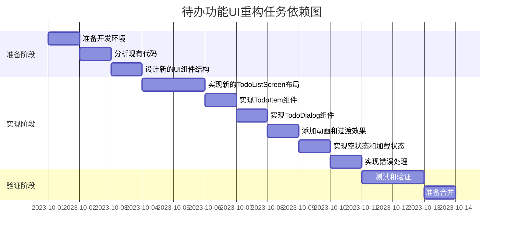

# 待办功能UI重构任务拆分文档

## 1. 子任务拆分

### 任务1: 准备开发环境

**输入契约：**
- 现有的HangDiary项目代码库
- Git环境
- Android开发环境

**输出契约：**
- 创建并切换到"todo-ui-refactor"开发分支
- 确保开发环境配置正确

**实现约束：**
- 使用Git命令行工具
- 确保新分支基于最新的master分支
- 不修改master分支的代码

**依赖关系：**
- 前置任务：无
- 后置任务：分析现有代码

### 任务2: 分析现有TodoListScreen代码

**输入契约：**
- TodoListScreen.kt文件
- 相关的ViewModel和Repository代码

**输出契约：**
- 理解现有UI实现方式
- 理解组件结构和布局
- 理解用户交互逻辑

**实现约束：**
- 不修改现有代码
- 详细分析组件间的交互
- 记录需要保留的功能点

**依赖关系：**
- 前置任务：准备开发环境
- 后置任务：设计新的UI组件

### 任务3: 设计新的UI组件结构

**输入契约：**
- 现有TodoListScreen的分析结果
- Material Design 3设计规范
- 常见的现代UI设计模式

**输出契约：**
- 新的TodoListScreen组件结构设计
- 新的TodoItem组件设计
- 新的TodoDialog组件设计

**实现约束：**
- 保持功能完整性
- 提升视觉效果和用户体验
- 遵循Material Design 3规范

**依赖关系：**
- 前置任务：分析现有TodoListScreen代码
- 后置任务：实现新的TodoListScreen布局

### 任务4: 实现新的TodoListScreen布局

**输入契约：**
- 新的UI组件结构设计
- 现有TodoListScreen的功能需求
- 应用的主题和样式

**输出契约：**
- 重构后的TodoListScreen.kt文件
- 实现新的界面布局
- 保持与ViewModel的正确交互

**实现约束：**
- 使用Jetpack Compose
- 遵循现有的代码规范
- 确保功能与原有实现一致

**依赖关系：**
- 前置任务：设计新的UI组件结构
- 后置任务：实现TodoItem组件

### 任务5: 实现TodoItem组件

**输入契约：**
- Todo实体类
- 新的UI设计需求
- 交互逻辑要求

**输出契约：**
- 重构后的TodoItem组件
- 实现待办事项的展示和交互

**实现约束：**
- 支持标记完成、编辑、删除操作
- 包含标题、内容、创建时间等信息展示
- 添加适当的动画效果

**依赖关系：**
- 前置任务：实现新的TodoListScreen布局
- 后置任务：实现TodoDialog组件

### 任务6: 实现TodoDialog组件

**输入契约：**
- 待办事项的添加和编辑需求
- 新的UI设计要求

**输出契约：**
- 重构后的TodoDialog组件
- 实现待办事项的添加和编辑功能

**实现约束：**
- 支持标题和内容输入
- 提供确认和取消操作
- 进行输入验证

**依赖关系：**
- 前置任务：实现TodoItem组件
- 后置任务：添加动画和过渡效果

### 任务7: 添加动画和过渡效果

**输入契约：**
- 重构后的UI组件
- Jetpack Compose的动画API

**输出契约：**
- 添加列表项的进入和退出动画
- 添加完成状态的切换动画
- 添加对话框的显示和隐藏动画

**实现约束：**
- 动画应流畅自然
- 不影响应用性能
- 提升用户体验

**依赖关系：**
- 前置任务：实现TodoDialog组件
- 后置任务：实现空状态和加载状态

### 任务8: 实现空状态和加载状态

**输入契约：**
- ViewModel的加载状态和数据状态
- 空状态设计需求

**输出契约：**
- 实现待办事项列表为空时的界面
- 实现数据加载时的界面
- 提供友好的用户提示

**实现约束：**
- 界面设计应符合整体风格
- 提供明确的操作指引
- 确保状态切换的平滑性

**依赖关系：**
- 前置任务：添加动画和过渡效果
- 后置任务：实现错误处理

### 任务9: 实现错误处理

**输入契约：**
- ViewModel的错误状态
- 错误处理设计需求

**输出契约：**
- 实现错误消息的展示
- 提供错误恢复的操作选项

**实现约束：**
- 错误消息应友好清晰
- 提供明确的用户操作指引
- 确保应用的稳定性

**依赖关系：**
- 前置任务：实现空状态和加载状态
- 后置任务：测试和验证

### 任务10: 测试和验证

**输入契约：**
- 重构后的待办功能UI
- 功能测试用例

**输出契约：**
- 验证所有功能正常工作
- 确认UI符合设计要求
- 修复发现的问题和缺陷

**实现约束：**
- 测试所有用户操作流程
- 确保没有引入新的bug
- 验证性能和稳定性

**依赖关系：**
- 前置任务：实现错误处理
- 后置任务：准备合并

### 任务11: 准备合并

**输入契约：**
- 通过测试验证的重构代码
- Git版本控制系统

**输出契约：**
- 提交重构代码到开发分支
- 推送到远程仓库
- 准备合并请求

**实现约束：**
- 遵循Git工作流
- 确保代码质量
- 提供清晰的提交信息

**依赖关系：**
- 前置任务：测试和验证
- 后置任务：无

## 2. 任务依赖图

## 3. 拆分原则说明

1. **复杂度可控**
   - 每个子任务的复杂度适中，便于独立完成和验证
   - 避免将过多功能集中在一个任务中

2. **按功能模块分解**
   - 按照UI组件的逻辑关系进行分解
   - 确保每个任务对应一个明确的功能点

3. **明确的验收标准**
   - 每个任务都有明确的输入和输出契约
   - 确保任务完成后可以独立验证

4. **依赖关系清晰**
   - 明确任务之间的依赖关系
   - 避免循环依赖

5. **循序渐进**
   - 从准备工作开始，逐步深入到核心实现
   - 最后进行测试和验证

通过以上任务拆分，我们可以有条不紊地进行待办功能UI的重构工作，确保每个阶段都有明确的目标和验收标准，最终实现高质量的重构结果。