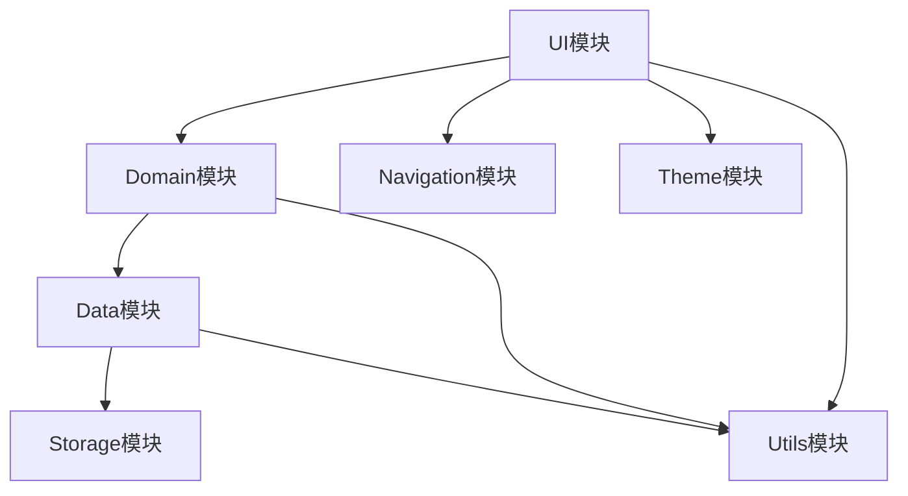
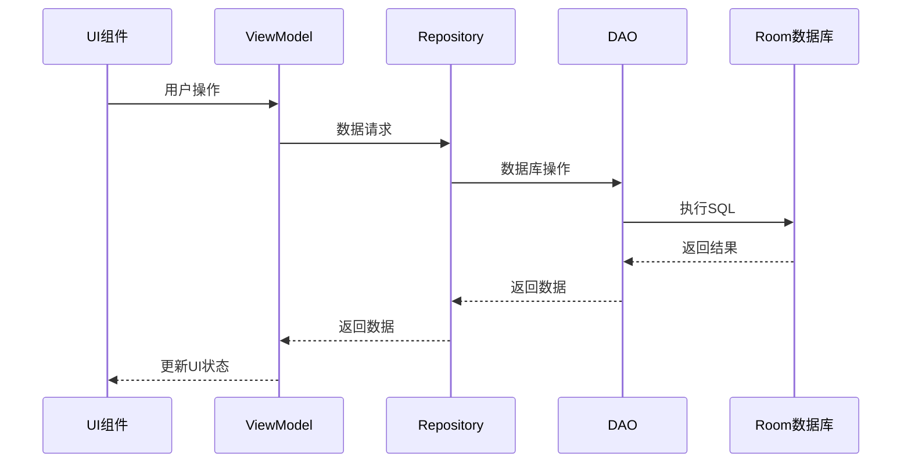
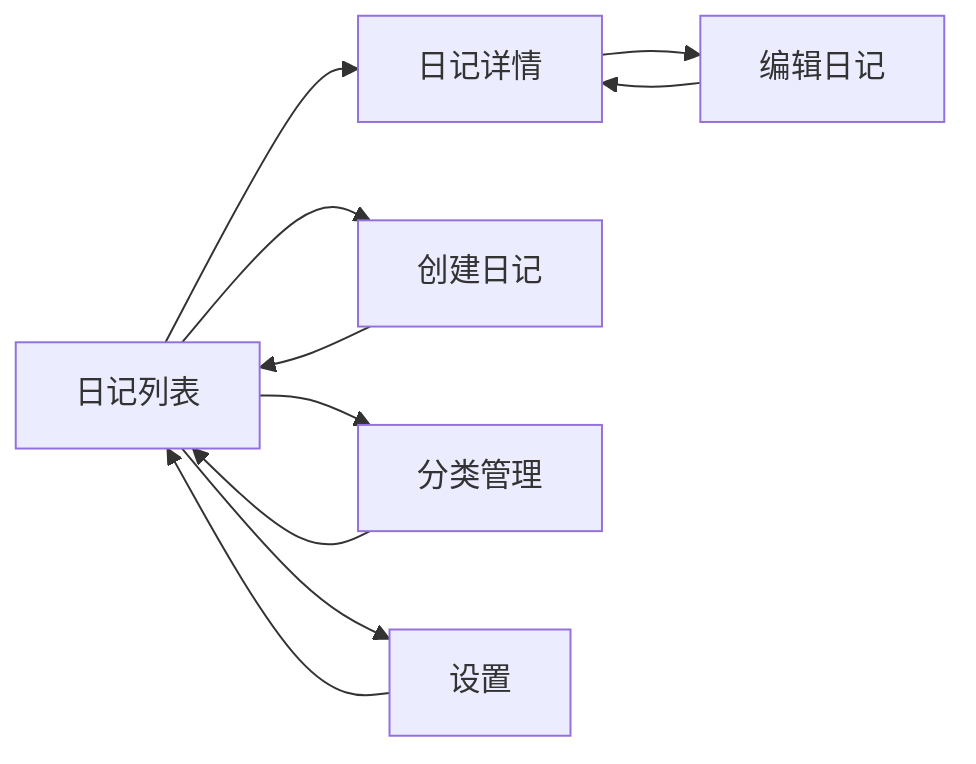

# 日记应用 DESIGN 文档

## 1. 整体架构图

```mermaid
flowchart TD
    A[表示层 (UI)] --> B[业务逻辑层]
    B --> C[数据访问层]
    C --> D[本地存储 (Room)]
    B --> E[依赖注入 (Hilt)]
    A --> F[导航组件]
    A --> G[主题与样式]
```

## 2. 分层设计和核心组件

### 2.1 表示层 (UI Layer)
- **组件**：Compose UI组件、屏幕、布局
- **职责**：展示数据、处理用户交互、导航
- **技术**：Jetpack Compose、Material 3

### 2.2 业务逻辑层 (Domain Layer)
- **组件**：ViewModel、Use Cases
- **职责**：处理业务逻辑、管理UI状态、协调数据流动
- **技术**：Kotlin Coroutines、Flow

### 2.3 数据访问层 (Data Layer)
- **组件**：Repository、Data Sources
- **职责**：提供数据访问接口、处理数据缓存、协调不同数据源
- **技术**：Repository Pattern

### 2.4 本地存储层 (Storage Layer)
- **组件**：Room数据库、实体类、DAO接口
- **职责**：持久化数据存储、数据查询
- **技术**：Room

### 2.5 辅助层 (Support Layer)
- **组件**：依赖注入、导航、主题
- **职责**：提供基础设施支持
- **技术**：Hilt、Navigation Compose、Material 3

## 3. 模块依赖关系图



## 4. 接口契约定义

### 4.1 数据层接口
```kotlin
interface DiaryRepository {
    suspend fun getAllDiaries(): Flow<List<Diary>>
    suspend fun getDiaryById(id: Int): Flow<Diary?>
    suspend fun insertDiary(diary: Diary): Long
    suspend fun updateDiary(diary: Diary)
    suspend fun deleteDiary(diary: Diary)
    suspend fun searchDiaries(query: String): Flow<List<Diary>>
}

interface CategoryRepository {
    suspend fun getAllCategories(): Flow<List<Category>>
    suspend fun getCategoryById(id: Int): Flow<Category?>
    suspend fun insertCategory(category: Category): Long
    suspend fun updateCategory(category: Category)
    suspend fun deleteCategory(category: Category)
}
```

### 4.2 DAO接口
```kotlin
@Dao
interface DiaryDao {
    @Query("SELECT * FROM diary ORDER BY updateTime DESC")
    fun getAllDiaries(): Flow<List<Diary>>

    @Query("SELECT * FROM diary WHERE id = :id")
    fun getDiaryById(id: Int): Flow<Diary?>

    @Insert
    suspend fun insertDiary(diary: Diary): Long

    @Update
    suspend fun updateDiary(diary: Diary)

    @Delete
    suspend fun deleteDiary(diary: Diary)

    @Query("SELECT * FROM diary WHERE title LIKE :query OR content LIKE :query ORDER BY updateTime DESC")
    fun searchDiaries(query: String): Flow<List<Diary>>
}

@Dao
interface CategoryDao {
    @Query("SELECT * FROM category ORDER BY name ASC")
    fun getAllCategories(): Flow<List<Category>>

    @Query("SELECT * FROM category WHERE id = :id")
    fun getCategoryById(id: Int): Flow<Category?>

    @Insert
    suspend fun insertCategory(category: Category): Long

    @Update
    suspend fun updateCategory(category: Category)

    @Delete
    suspend fun deleteCategory(category: Category)
}
```

## 5. 数据流向图



## 6. 异常处理策略

### 6.1 异常分类
- **数据异常**：数据库操作失败、数据格式错误
- **网络异常**：（本应用无网络功能）
- **UI异常**：布局渲染错误、用户输入验证失败
- **系统异常**：设备兼容性问题、权限不足

### 6.2 处理策略
- **数据异常**：使用try-catch捕获，返回错误状态和默认数据
- **UI异常**：输入验证、错误提示、崩溃保护
- **系统异常**：权限请求、兼容性适配、错误日志记录

### 6.3 错误反馈机制
- Toast提示
-  Snackbar提示
- 错误页面展示
- 日志记录

## 7. 主题与样式设计

### 7.1 色彩方案
- 主色调：使用柔和的蓝色系 (#4F6EF5)，传达平静和信任感
- 辅助色：使用温暖的橙色系 (#FF9800)，用于强调和交互元素
- 中性色：白色、浅灰、深灰、黑色，用于背景和文本

### 7.2 排版方案
- 标题：使用较大字号、粗体
- 正文：清晰易读的字号和行高
- 辅助文字：较小字号、浅色

### 7.3 组件样式
- 按钮：圆角设计、明确的状态反馈
- 卡片：轻微阴影、适当边距
- 输入框：清晰的边框和焦点状态

## 8. 导航设计

### 8.1 导航结构
- 主页：日记列表
- 编辑页：创建/编辑日记
- 详情页：查看日记详情
- 分类页：管理日记分类
- 设置页：应用设置

### 8.2 导航流程


## 9. 性能优化策略

### 9.1 数据加载优化
- 使用Flow进行异步数据加载
- 实现数据分页加载
- 采用缓存机制减少数据库查询

### 9.2 UI渲染优化
- 使用Compose的懒加载组件
- 避免不必要的重组
- 优化动画性能

### 9.3 存储优化
- 定期清理无效数据
- 优化数据库索引
- 提供数据导出和清理功能

## 10. 测试策略

### 10.1 单元测试
- 测试数据层逻辑
- 测试业务逻辑
- 测试工具类

### 10.2 集成测试
- 测试数据库操作
- 测试Repository实现
- 测试ViewModel与Repository的交互

### 10.3 UI测试
- 测试Compose组件渲染
- 测试用户交互流程
- 测试导航功能

以上设计基于CONSENSUS文档和Android最佳实践制定，如有新的需求或约束，可进行相应调整。