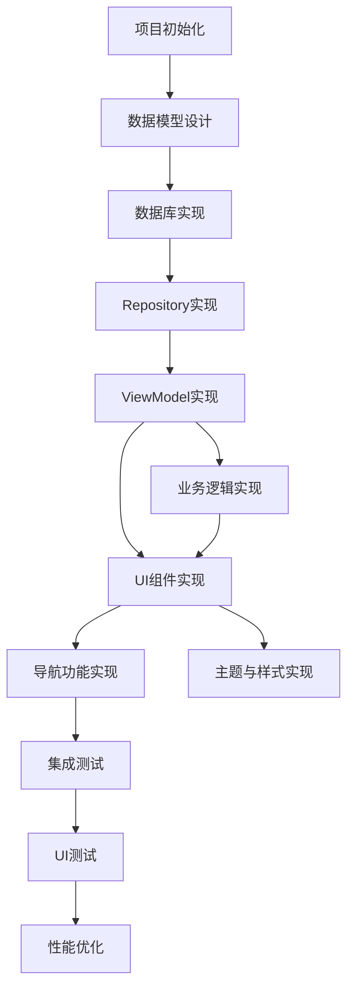

# 日记应用 TASK 文档

## 1. 任务依赖图

## 2. 原子任务拆分

### 2.1 任务1: 项目初始化
- **任务ID**: T001
- **输入契约**: 空
- **输出契约**: 
  - 项目结构搭建完成
  - 依赖项配置完成
  - 基础Activity创建完成
- **实现约束**: 
  - 使用Kotlin语言
  - 使用Jetpack Compose
  - 最小SDK版本24
  - 目标SDK版本36
- **依赖关系**: 无前置依赖
- **验收标准**: 项目能够成功编译运行

### 2.2 任务2: 数据模型设计
- **任务ID**: T002
- **输入契约**: 
  - 需求文档
  - 设计文档
- **输出契约**: 
  - Diary实体类
  - Category实体类
- **实现约束**: 
  - 使用Kotlin数据类
  - 使用Room注解
  - 包含必要的字段和关系
- **依赖关系**: 依赖T001
- **验收标准**: 数据模型符合需求，字段完整

### 2.3 任务3: 数据库实现
- **任务ID**: T003
- **输入契约**: 
  - Diary实体类
  - Category实体类
- **输出契约**: 
  - DiaryDao接口
  - CategoryDao接口
  - AppDatabase类
- **实现约束**: 
  - 使用Room数据库
  - 包含必要的查询方法
  - 配置数据库版本管理
- **依赖关系**: 依赖T002
- **验收标准**: 数据库能够正确创建，CRUD操作正常

### 2.4 任务4: Repository实现
- **任务ID**: T004
- **输入契约**: 
  - DiaryDao接口
  - CategoryDao接口
- **输出契约**: 
  - DiaryRepository实现
  - CategoryRepository实现
- **实现约束**: 
  - 使用Repository模式
  - 处理数据缓存
  - 提供 suspend 函数
- **依赖关系**: 依赖T003
- **验收标准**: Repository能够正确获取和操作数据

### 2.5 任务5: ViewModel实现
- **任务ID**: T005
- **输入契约**: 
  - DiaryRepository
  - CategoryRepository
- **输出契约**: 
  - DiaryListViewModel
  - DiaryDetailViewModel
  - CategoryViewModel
- **实现约束**: 
  - 使用AndroidX ViewModel
  - 使用Coroutines和Flow
  - 管理UI状态
- **依赖关系**: 依赖T004
- **验收标准**: ViewModel能够正确管理数据和UI状态

### 2.6 任务6: UI组件实现
- **任务ID**: T006
- **输入契约**: 
  - ViewModel类
  - 设计文档
- **输出契约**: 
  - 日记列表组件
  - 日记详情组件
  - 日记编辑组件
  - 分类管理组件
  - 设置组件
- **实现约束**: 
  - 使用Jetpack Compose
  - 遵循Material 3设计规范
  - 支持中文显示
- **依赖关系**: 依赖T005
- **验收标准**: UI组件能够正确渲染和响应用户操作

### 2.7 任务7: 导航功能实现
- **任务ID**: T007
- **输入契约**: 
  - UI组件
  - 设计文档
- **输出契约**: 
  - 导航图
  - 导航逻辑实现
- **实现约束**: 
  - 使用Navigation Compose
  - 实现正确的页面跳转逻辑
  - 处理参数传递
- **依赖关系**: 依赖T006
- **验收标准**: 能够在不同页面间正确导航

### 2.8 任务8: 主题与样式实现
- **任务ID**: T008
- **输入契约**: 
  - 设计文档
- **输出契约**: 
  - 主题配置
  - 样式定义
  - 色彩方案
- **实现约束**: 
  - 使用Material 3主题
  - 支持深色/浅色模式
  - 定义一致的色彩和排版
- **依赖关系**: 依赖T001
- **验收标准**: 主题和样式符合设计要求，切换正常

### 2.9 任务9: 业务逻辑实现
- **任务ID**: T009
- **输入契约**: 
  - ViewModel类
  - 需求文档
- **输出契约**: 
  - 日记CRUD操作实现
  - 分类管理实现
  - 搜索功能实现
- **实现约束**: 
  - 使用Coroutines处理异步任务
  - 实现数据验证
  - 处理异常情况
- **依赖关系**: 依赖T005
- **验收标准**: 业务逻辑正确，异常处理完善

### 2.10 任务10: 集成测试
- **任务ID**: T010
- **输入契约**: 
  - Repository类
  - ViewModel类
- **输出契约**: 
  - 集成测试用例
- **实现约束**: 
  - 使用JUnit和Mockito
  - 测试数据流程
  - 测试业务逻辑
- **依赖关系**: 依赖T005
- **验收标准**: 测试通过率100%

### 2.11 任务11: UI测试
- **任务ID**: T011
- **输入契约**: 
  - UI组件
- **输出契约**: 
  - UI测试用例
- **实现约束**: 
  - 使用Compose测试工具
  - 测试UI渲染
  - 测试用户交互
- **依赖关系**: 依赖T006
- **验收标准**: 测试通过率100%

### 2.12 任务12: 性能优化
- **任务ID**: T012
- **输入契约**: 
  - 应用代码
  - 测试结果
- **输出契约**: 
  - 优化后的代码
  - 性能测试报告
- **实现约束**: 
  - 优化数据加载
  - 优化UI渲染
  - 优化内存使用
- **依赖关系**: 依赖T010, T011
- **验收标准**: 应用性能提升，无明显卡顿

## 3. 任务执行顺序

1. T001: 项目初始化
2. T002: 数据模型设计
3. T003: 数据库实现
4. T004: Repository实现
5. T005: ViewModel实现
6. T008: 主题与样式实现
7. T009: 业务逻辑实现
8. T006: UI组件实现
9. T007: 导航功能实现
10. T010: 集成测试
11. T011: UI测试
12. T012: 性能优化

## 4. 里程碑定义

- **里程碑1**: 项目基础架构完成 (T001-T005)
- **里程碑2**: 核心功能实现完成 (T006-T009)
- **里程碑3**: 测试与优化完成 (T010-T012)
- **里程碑4**: 应用发布准备完成

## 5. 风险评估与应对

- **技术风险**: Jetpack Compose版本兼容性问题
  - 应对: 使用稳定版本，及时更新依赖
- **进度风险**: 任务延期
  - 应对: 合理安排任务优先级，并行处理独立任务
- **质量风险**: 代码质量不达标
  - 应对: 严格遵循编码规范，加强代码审查
- **测试风险**: 测试覆盖不充分
  - 应对: 制定详细测试计划，覆盖核心功能和边界条件

以上任务拆分基于DESIGN文档和需求分析制定，如有新的需求或约束，可进行相应调整。