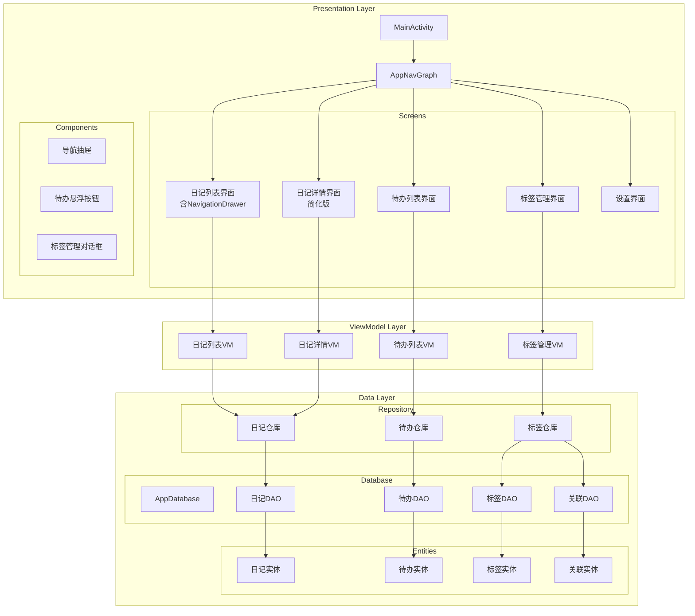
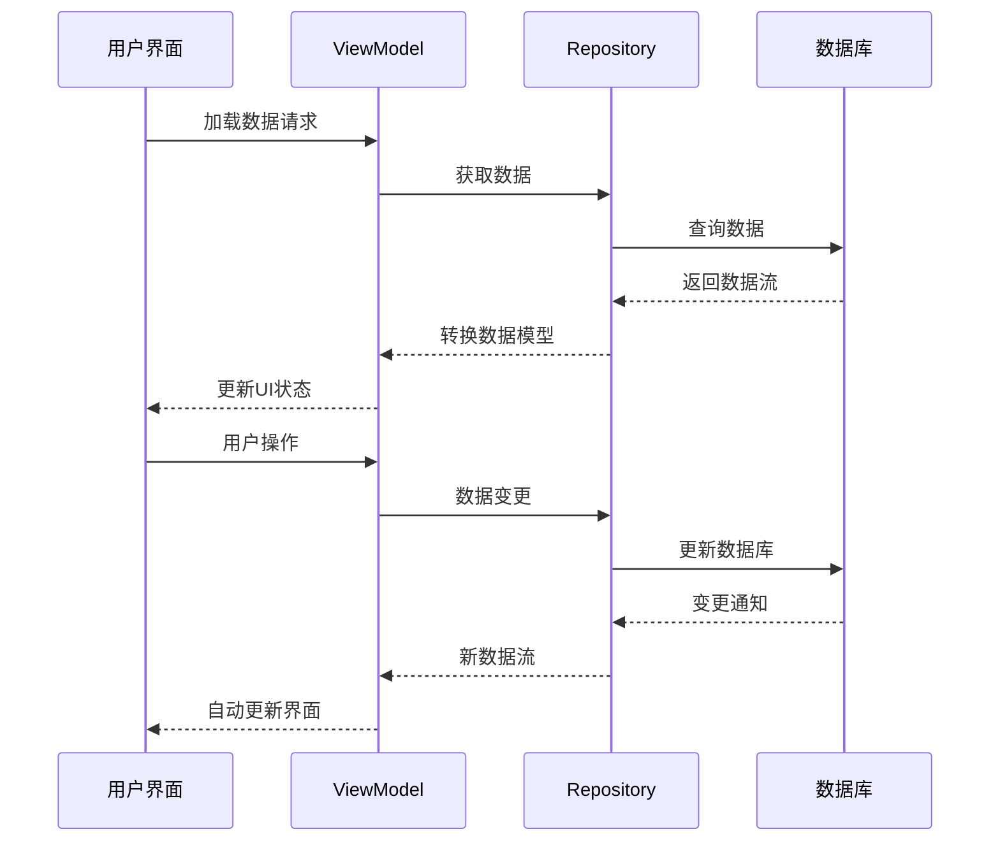

# 日记应用优化架构设计文档

## 整体架构图



## 分层设计

### 1. 表示层 (Presentation Layer)

#### 1.1 导航结构
```kotlin
sealed class Screen(val route: String) {
    object DiaryList : Screen("diaryList")
    object DiaryDetail : Screen("diaryDetail/{diaryId}") {
        fun createRoute(diaryId: Long) = "diaryDetail/$diaryId"
    }
    object TodoList : Screen("todoList")
    object TagManagement : Screen("tagManagement")
    object Settings : Screen("settings")
}
```

#### 1.2 界面组件
- **DiaryListScreen**: 主界面，集成NavigationDrawer
- **DiaryDetailScreen**: 简化版日记编辑界面
- **TodoListScreen**: 待办事项管理界面
- **TagManagementScreen**: 标签CRUD管理界面
- **SettingsScreen**: 应用设置界面

### 2. 业务逻辑层 (Domain Layer)

#### 2.1 ViewModel设计
```kotlin
// 日记相关
class DiaryListViewModel @Inject constructor(
    private val diaryRepository: DiaryRepository,
    private val tagRepository: TagRepository
) : ViewModel()

class DiaryDetailViewModel @Inject constructor(
    private val diaryRepository: DiaryRepository
) : ViewModel()

// 待办相关
class TodoListViewModel @Inject constructor(
    private val todoRepository: TodoRepository
) : ViewModel()

// 标签相关
class TagManagementViewModel @Inject constructor(
    private val tagRepository: TagRepository
) : ViewModel()
```

### 3. 数据层 (Data Layer)

#### 3.1 数据库结构
```kotlin
// 待办实体
@Entity(tableName = "todos")
data class Todo(
    @PrimaryKey(autoGenerate = true) val id: Long = 0,
    val title: String,
    val content: String? = null,
    val isCompleted: Boolean = false,
    val createdAt: LocalDateTime,
    val updatedAt: LocalDateTime? = null,
    val dueDate: LocalDateTime? = null
)

// 标签实体
@Entity(tableName = "tags")
data class Tag(
    @PrimaryKey(autoGenerate = true) val id: Long = 0,
    val name: String,
    val color: Int,
    val createdAt: LocalDateTime
)

// 日记-标签关联
@Entity(
    tableName = "diary_tags",
    foreignKeys = [
        ForeignKey(
            entity = Diary::class,
            parentColumns = ["id"],
            childColumns = ["diaryId"],
            onDelete = ForeignKey.CASCADE
        ),
        ForeignKey(
            entity = Tag::class,
            parentColumns = ["id"],
            childColumns = ["tagId"],
            onDelete = ForeignKey.CASCADE
        )
    ],
    indices = [Index("diaryId"), Index("tagId")]
)
data class DiaryTagCrossRef(
    val diaryId: Long,
    val tagId: Long,
    @PrimaryKey(autoGenerate = true) val id: Long = 0
)
```

#### 3.2 DAO接口
```kotlin
@Dao
interface TodoDao {
    @Query("SELECT * FROM todos ORDER BY createdAt DESC")
    fun getAllTodos(): Flow<List<Todo>>
    
    @Insert
    suspend fun insertTodo(todo: Todo)
    
    @Update
    suspend fun updateTodo(todo: Todo)
    
    @Delete
    suspend fun deleteTodo(todo: Todo)
}

@Dao
interface TagDao {
    @Query("SELECT * FROM tags ORDER BY name ASC")
    fun getAllTags(): Flow<List<Tag>>
    
    @Insert
    suspend fun insertTag(tag: Tag)
    
    @Update
    suspend fun updateTag(tag: Tag)
    
    @Delete
    suspend fun deleteTag(tag: Tag)
    
    @Query("SELECT * FROM tags WHERE name LIKE :query")
    fun searchTags(query: String): Flow<List<Tag>>
}

@Dao
interface DiaryTagDao {
    @Insert
    suspend fun insertDiaryTag(diaryTag: DiaryTagCrossRef)
    
    @Delete
    suspend fun deleteDiaryTag(diaryTag: DiaryTagCrossRef)
    
    @Query("SELECT tags.* FROM tags INNER JOIN diary_tags ON tags.id = diary_tags.tagId WHERE diary_tags.diaryId = :diaryId")
    fun getTagsForDiary(diaryId: Long): Flow<List<Tag>>
}
```

## 界面设计规范

### 1. NavigationDrawer设计
```kotlin
@Composable
fun AppNavigationDrawer(
    drawerState: DrawerState,
    onItemClick: (Screen) -> Unit,
    content: @Composable () -> Unit
) {
    ModalNavigationDrawer(
        drawerState = drawerState,
        drawerContent = {
            ModalDrawerSheet {
                // 抽屉头部
                DrawerHeader()
                
                // 菜单项
                NavigationDrawerItem(
                    icon = { Icon(Icons.Default.Book, contentDescription = null) },
                    label = { Text("全部日记") },
                    selected = currentRoute == Screen.DiaryList.route,
                    onClick = { onItemClick(Screen.DiaryList) }
                )
                
                NavigationDrawerItem(
                    icon = { Icon(Icons.Default.Label, contentDescription = null) },
                    label = { Text("标签管理") },
                    selected = currentRoute == Screen.TagManagement.route,
                    onClick = { onItemClick(Screen.TagManagement) }
                )
                
                NavigationDrawerItem(
                    icon = { Icon(Icons.Default.CheckCircle, contentDescription = null) },
                    label = { Text("待办事项") },
                    selected = currentRoute == Screen.TodoList.route,
                    onClick = { onItemClick(Screen.TodoList) }
                )
                
                NavigationDrawerItem(
                    icon = { Icon(Icons.Default.Settings, contentDescription = null) },
                    label = { Text("设置") },
                    selected = currentRoute == Screen.Settings.route,
                    onItemClick = { onItemClick(Screen.Settings) }
                )
            }
        },
        content = content
    )
}
```

### 2. 待办悬浮按钮设计
```kotlin
@Composable
fun TodoFloatingActionButton(
    onClick: () -> Unit,
    modifier: Modifier = Modifier
) {
    FloatingActionButton(
        onClick = onClick,
        modifier = modifier,
        containerColor = MaterialTheme.colorScheme.secondary
    ) {
        Icon(
            imageVector = Icons.Default.CheckCircle,
            contentDescription = "添加待办",
            tint = Color.White
        )
    }
}
```

### 3. 标签对话框设计
```kotlin
@Composable
fun TagManagementDialog(
    diary: Diary,
    onDismiss: () -> Unit,
    onTagsUpdated: (List<Tag>) -> Unit
) {
    AlertDialog(
        onDismissRequest = onDismiss,
        title = { Text("管理标签") },
        text = {
            Column {
                // 当前标签展示
                FlowRow {
                    // 标签Chip组件
                }
                
                // 添加新标签
                OutlinedTextField(
                    value = newTagName,
                    onValueChange = { newTagName = it },
                    label = { Text("新标签名称") },
                    trailingIcon = {
                        IconButton(onClick = { addTag() }) {
                            Icon(Icons.Default.Add, contentDescription = "添加")
                        }
                    }
                )
            }
        },
        confirmButton = {
            TextButton(onClick = onDismiss) {
                Text("完成")
            }
        }
    )
}
```

## 数据流向图



## 异常处理策略

### 1. 数据异常处理
```kotlin
sealed class DataState<out T> {
    data object Loading : DataState<Nothing>()
    data class Success<T>(val data: T) : DataState<T>()
    data class Error(val exception: Exception) : DataState<Nothing>()
}

// ViewModel中的错误处理
fun loadDiaries() {
    viewModelScope.launch {
        try {
            _diaryState.value = DataState.Loading
            diaryRepository.getAllDiaries()
                .catch { e -> _diaryState.value = DataState.Error(e) }
                .collect { diaries -> _diaryState.value = DataState.Success(diaries) }
        } catch (e: Exception) {
            _diaryState.value = DataState.Error(e)
        }
    }
}
```

### 2. 用户输入验证
```kotlin
fun validateTagName(name: String): ValidationResult {
    return when {
        name.isBlank() -> ValidationResult.Error("标签名称不能为空")
        name.length > 20 -> ValidationResult.Error("标签名称不能超过20个字符")
        else -> ValidationResult.Success
    }
}

sealed class ValidationResult {
    data object Success : ValidationResult()
    data class Error(val message: String) : ValidationResult()
}
```

## 性能优化策略

### 1. 数据库优化
- 使用索引优化查询性能
- 批量操作减少数据库访问
- 使用Flow进行响应式更新

### 2. UI优化
- LazyColumn实现虚拟化列表
- rememberSaveable保持状态
- 使用derivedStateOf优化重组

### 3. 内存管理
- 及时清理ViewModel中的资源
- 使用WeakReference避免内存泄漏
- 图片资源合理压缩