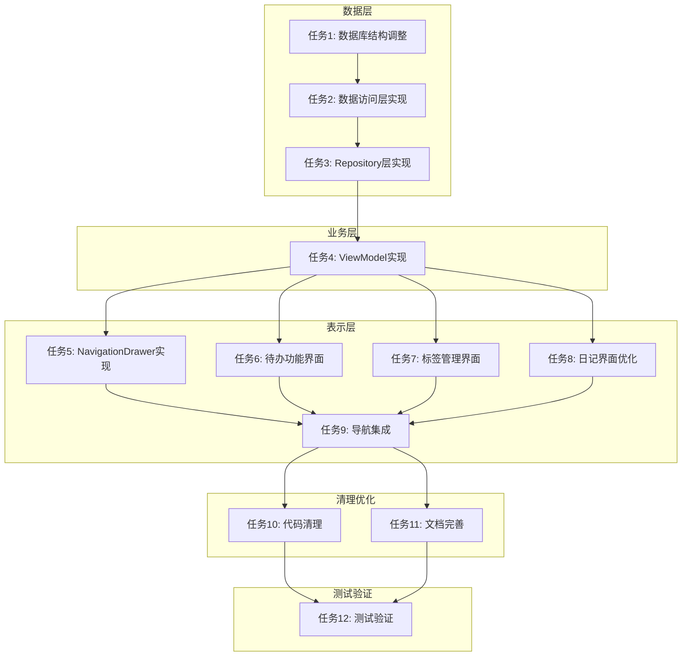

# 日记应用优化任务拆分文档

## 任务依赖图



## 原子任务清单

### 任务1: 数据库结构调整
**优先级**: P0 - 基础依赖
**输入契约**:
- 现有AppDatabase结构
- 当前Diary实体定义

**输出契约**:
- 新增Todo实体和DAO
- 新增Tag实体和关联表
- 数据库版本升级脚本
- 迁移测试数据

**实现约束**:
- 保持向后兼容
- 使用Room自动迁移
- 不删除现有字段

**验收标准**:
- [ ] 数据库升级无数据丢失
- [ ] 新表创建成功
- [ ] 关联关系正确建立

**代码示例**:
```kotlin
// 数据库版本升级
@Database(
    entities = [Diary::class, Todo::class, Tag::class, DiaryTagCrossRef::class],
    version = 2,
    autoMigrations = [
        AutoMigration(from = 1, to = 2)
    ]
)
```

### 任务2: 数据访问层实现
**优先级**: P0
**前置任务**: 任务1

**输入契约**:
- 任务1中定义的新实体
- Room DAO规范

**输出契约**:
- TodoDao完整实现
- TagDao完整实现
- DiaryTagDao关联查询

**实现约束**:
- 使用Flow响应式查询
- 支持事务操作
- 异常处理完整

**验收标准**:
- [ ] 所有CRUD操作正常
- [ ] 关联查询结果正确
- [ ] 异常处理覆盖

### 任务3: Repository层实现
**优先级**: P0
**前置任务**: 任务2

**输入契约**:
- 任务2中的DAO接口
- Repository模式规范

**输出契约**:
- TodoRepository实现
- TagRepository实现
- 统一的错误处理

**实现约束**:
- 使用依赖注入
- 支持离线缓存
- 统一的异常封装

**验收标准**:
- [ ] 业务逻辑正确封装
- [ ] 错误处理一致
- [ ] 单元测试覆盖80%+

### 任务4: ViewModel实现
**优先级**: P0
**前置任务**: 任务3

**输入契约**:
- 任务3中的Repository
- ViewModel最佳实践

**输出契约**:
- TodoListViewModel
- TagManagementViewModel
- 状态管理实现

**实现约束**:
- 使用StateFlow状态管理
- 支持配置变更恢复
- 生命周期感知

**验收标准**:
- [ ] 状态管理正确
- [ ] 内存泄漏检查
- [ ] 配置变更测试

### 任务5: NavigationDrawer实现
**优先级**: P1
**前置任务**: 任务4

**输入契约**:
- 现有TopAppBar结构
- Material3 NavigationDrawer规范

**输出契约**:
- ModalNavigationDrawer实现
- 菜单项配置
- 手势处理

**实现约束**:
- 保持现有导航结构
- 支持手势操作
- 动画流畅

**验收标准**:
- [ ] 手势响应正确
- [ ] 菜单项点击正常
- [ ] 状态切换流畅

**界面代码**:
```kotlin
@Composable
fun DiaryListScreen(
    viewModel: DiaryListViewModel,
    navController: NavController
) {
    val drawerState = rememberDrawerState(DrawerValue.Closed)
    val scope = rememberCoroutineScope()
    
    ModalNavigationDrawer(
        drawerState = drawerState,
        drawerContent = {
            ModalDrawerSheet {
                // 抽屉内容
            }
        }
    ) {
        Scaffold(
            topBar = {
                TopAppBar(
                    navigationIcon = {
                        IconButton(onClick = { 
                            scope.launch { drawerState.open() }
                        }) {
                            Icon(Icons.Default.Menu, "菜单")
                        }
                    }
                )
            }
        ) { paddingValues ->
            // 主内容
        }
    }
}
```

### 任务6: 待办功能界面
**优先级**: P1
**前置任务**: 任务4

**输入契约**:
- TodoListViewModel
- 待办业务逻辑

**输出契约**:
- TodoListScreen完整实现
- TodoItem组件
- 新建/编辑对话框

**实现约束**:
- 使用LazyColumn优化性能
- 支持滑动删除
- 空状态处理

**验收标准**:
- [ ] 列表滚动流畅
- [ ] 状态切换正确
- [ ] 空状态提示清晰

### 任务7: 标签管理界面
**优先级**: P1
**前置任务**: 任务4

**输入契约**:
- TagManagementViewModel
- 长按手势识别

**输出契约**:
- TagManagementDialog
- 标签选择界面
- 标签编辑功能

**实现约束**:
- 支持多标签选择
- 实时搜索过滤
- 标签颜色选择

**验收标准**:
- [ ] 长按响应正确
- [ ] 标签管理完整
- [ ] 搜索功能正常

### 任务8: 日记界面优化
**优先级**: P1
**前置任务**: 任务4

**输入契约**:
- 现有DiaryDetailScreen
- 简化需求规范

**输出契约**:
- 移除多余字段的界面
- 日期格式化显示
- 输入验证

**实现约束**:
- 保持用户体验
- 输入验证友好
- 错误提示清晰

**验收标准**:
- [ ] 界面简洁清晰
- [ ] 日期显示正确
- [ ] 输入验证完整

**界面简化**:
```kotlin
@Composable
fun DiaryDetailScreen(
    viewModel: DiaryDetailViewModel,
    navController: NavController
) {
    Scaffold(
        topBar = { /* 简化顶部栏 */ }
    ) { paddingValues ->
        Column(
            modifier = Modifier
                .fillMaxSize()
                .padding(paddingValues)
                .verticalScroll(rememberScrollState())
        ) {
            // 标题输入
            OutlinedTextField(
                value = title,
                onValueChange = { title = it },
                label = { Text("标题") }
            )
            
            // 自动日期显示
            Text(
                text = currentDate.formatChinese(),
                style = MaterialTheme.typography.bodyMedium
            )
            
            // 内容输入
            OutlinedTextField(
                value = content,
                onValueChange = { content = it },
                label = { Text("内容") },
                modifier = Modifier.fillMaxWidth()
            )
        }
    }
}
```

### 任务9: 导航集成
**优先级**: P2
**前置任务**: 任务5-8

**输入契约**:
- 所有界面实现
- Navigation组件

**输出契约**:
- AppNavGraph更新
- 路由配置
- 参数传递

**实现约束**:
- 保持向后兼容
- 支持深层链接
- 导航状态恢复

**验收标准**:
- [ ] 导航流畅
- [ ] 参数传递正确
- [ ] 状态恢复正常

### 任务10: 代码清理
**优先级**: P2
**前置任务**: 任务9

**输入契约**:
- 现有代码库
- 清理需求清单

**输出契约**:
- 移除无用代码
- 重构优化
- 代码规范检查

**清理清单**:
- [x] 移除mood相关UI组件
- [x] 移除weather相关UI组件
- [ ] 移除category相关UI组件
- [x] 清理ViewModel中相关逻辑
- [x] 清理Repository中相关方法
- [x] 更新字符串资源

### 任务11: 文档完善
**优先级**: P3
**前置任务**: 任务10

**输入契约**:
- 项目根目录
- README模板

**输出契约**:
- README.md完整文档
- 功能使用说明
- 开发指南更新

**文档结构**:
```markdown
# HangDiary - 简洁日记应用

## 功能特性
- 📔 日记记录与管理
- ✅ 待办事项追踪
- 🏷️ 标签系统
- 🔍 全文搜索
- 📱 Material Design 3

## 技术栈
- Kotlin + Jetpack Compose
- Room数据库
- Navigation组件
- Material Design 3

## 安装指南
...

## 使用说明
...

## 开发指南
...
```

### 任务12: 测试验证
**优先级**: P3
**前置任务**: 任务11

**输入契约**:
- 完整功能实现
- 测试框架配置

**输出契约**:
- 单元测试套件
- 集成测试用例
- 测试报告

**测试范围**:
- [ ] 数据库操作测试
- [ ] ViewModel逻辑测试
- [ ] UI组件测试
- [ ] 导航流程测试
- [ ] 边界条件测试

## 任务执行计划

### 第一阶段 (P0任务)
1. 任务1: 数据库结构调整 (2小时)
2. 任务2: 数据访问层实现 (1.5小时)
3. 任务3: Repository层实现 (1.5小时)
4. 任务4: ViewModel实现 (2小时)

### 第二阶段 (P1任务)
5. 任务5: NavigationDrawer实现 (2小时)
6. 任务6: 待办功能界面 (2.5小时)
7. 任务7: 标签管理界面 (2小时)
8. 任务8: 日记界面优化 (1.5小时)

### 第三阶段 (P2任务)
9. 任务9: 导航集成 (1小时)
10. 任务10: 代码清理 (1.5小时)

### 第四阶段 (P3任务)
11. 任务11: 文档完善 (1小时)
12. 任务12: 测试验证 (2小时)

**总计预估时间**: 约19小时

## 风险与应对

### 技术风险
1. **数据库迁移**: 使用Room自动迁移，测试数据完整性
2. **导航冲突**: 逐步替换现有导航，保持向后兼容
3. **性能问题**: 使用LazyColumn和remember优化

### 进度风险
1. **任务依赖**: 按优先级顺序执行，确保前置完成
2. **复杂度评估**: 预留20%缓冲时间
3. **测试覆盖**: 关键路径优先测试