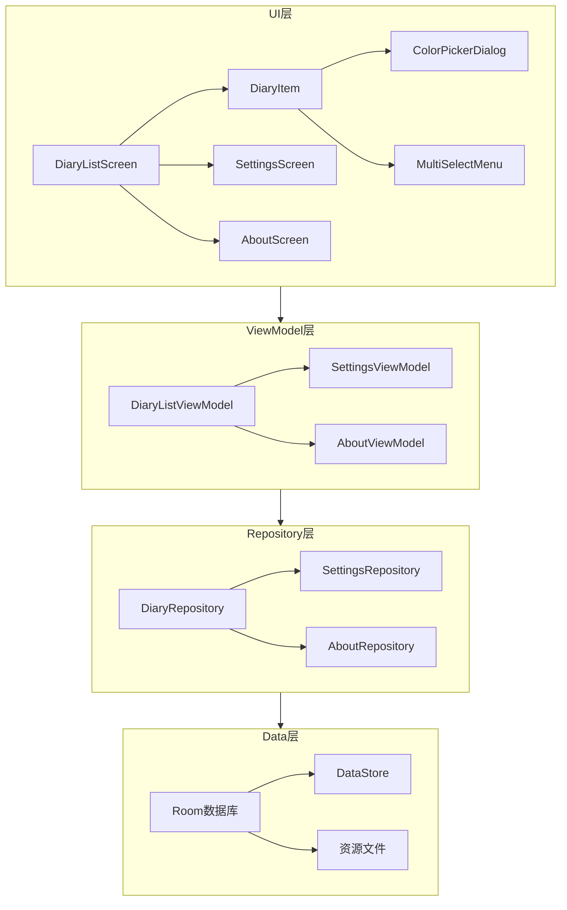
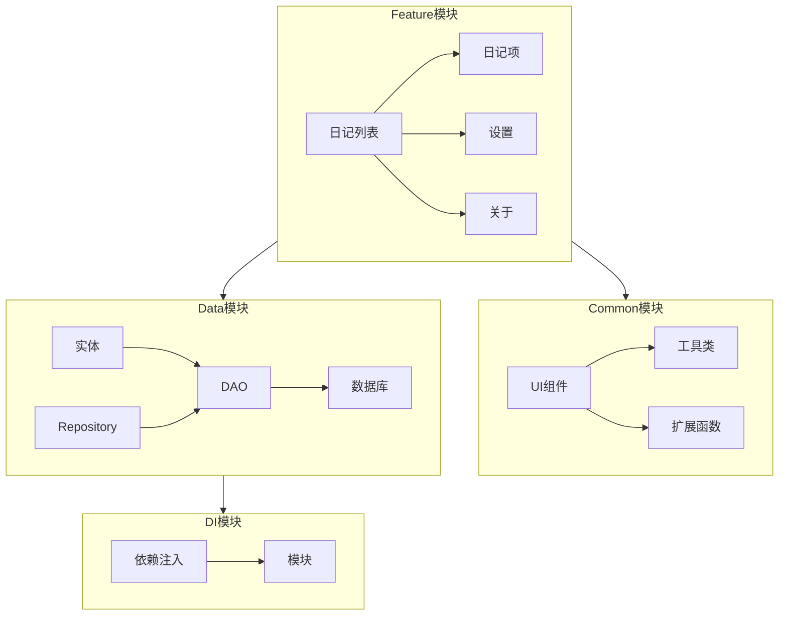
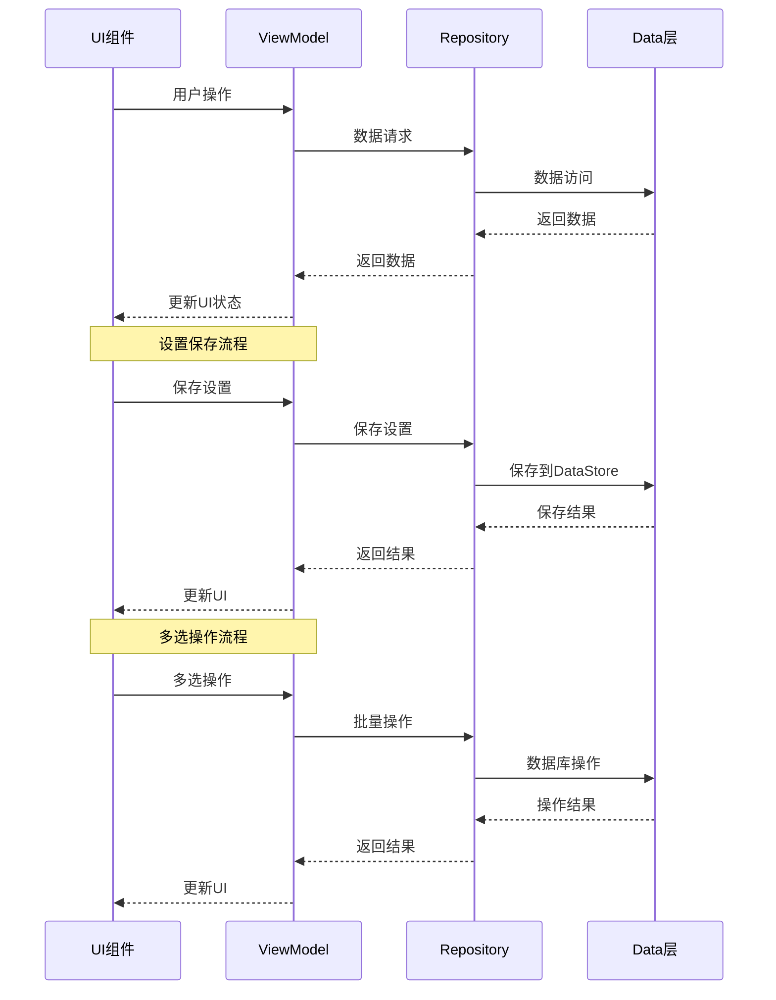

# 日记应用界面优化 - 设计文档

## 整体架构图



## 分层设计和核心组件

### UI层
- **DiaryListScreen**: 主界面日记列表组件
  - 负责显示日记列表
  - 支持列表和网格两种显示模式
  - 处理日记项的点击和长按事件
  - 管理多选模式的状态
  
- **DiaryItem**: 日记项组件
  - 显示单个日记的标题、时间、内容、标签
  - 支持自定义卡片颜色
  - 处理点击和长按事件
  - 在多选模式下显示选择状态
  
- **SettingsScreen**: 设置页面组件
  - 提供主题设置选项（深、浅、系统主题）
  - 提供视图设置选项（列表、网格）
  - 提供字体大小设置选项（小、中、大）
  - 保存和应用用户设置
  
- **AboutScreen**: 关于页面组件
  - 显示项目基本信息
  - 显示作者信息
  - 显示项目架构和功能
  - 显示版本和更新日志
  - 显示联系作者和使用方法
  - 显示使用的库信息
  
- **ColorPickerDialog**: 颜色选择对话框
  - 提供预设颜色选项
  - 处理颜色选择事件
  
- **MultiSelectMenu**: 多选菜单组件
  - 提供删除、设置卡片颜色、顶置、克隆、分享、标签等功能选项
  - 处理菜单项点击事件

### ViewModel层
- **DiaryListViewModel**: 日记列表视图模型
  - 管理日记列表数据
  - 管理视图模式（列表/网格）
  - 管理多选模式状态
  - 处理日记项的删除、克隆、分享等操作
  - 处理日记卡片颜色的设置
  
- **SettingsViewModel**: 设置视图模型
  - 管理用户设置数据
  - 处理主题设置的保存和应用
  - 处理视图设置的保存和应用
  - 处理字体大小设置的保存和应用
  
- **AboutViewModel**: 关于视图模型
  - 管理关于页面数据
  - 从资源文件加载项目信息

### Repository层
- **DiaryRepository**: 日记仓库
  - 封装日记数据的访问逻辑
  - 提供日记的增删改查方法
  - 处理日记的克隆操作
  
- **SettingsRepository**: 设置仓库
  - 封装用户设置的访问逻辑
  - 提供设置的保存和加载方法
  - 使用DataStore持久化用户设置
  
- **AboutRepository**: 关于仓库
  - 封装关于页面数据的访问逻辑
  - 从资源文件加载项目信息

### Data层
- **Room数据库**: 存储日记、待办事项、标签等数据
- **DataStore**: 存储用户偏好设置
- **资源文件**: 存储关于页面的静态信息

## 模块依赖关系图



## 接口契约定义

### UI层接口
```kotlin
// 日记列表组件接口
interface DiaryListScreen {
    fun onViewModeChanged(mode: ViewMode) // 视图模式变更
    fun onDiaryClicked(diaryId: Long) // 日记点击
    fun onDiaryLongClicked(diaryId: Long) // 日记长按
    fun onMultiSelectAction(action: MultiSelectAction, selectedIds: List<Long>) // 多选操作
}

// 设置页面接口
interface SettingsScreen {
    fun onThemeChanged(theme: Theme) // 主题变更
    fun onViewModeChanged(mode: ViewMode) // 视图模式变更
    fun onFontSizeChanged(size: FontSize) // 字体大小变更
}

// 关于页面接口
interface AboutScreen {
    fun onLinkClicked(url: String) // 链接点击
}
```

### ViewModel层接口
```kotlin
// 日记列表视图模型接口
interface DiaryListViewModel {
    fun getDiaries(): Flow<List<Diary>> // 获取日记列表
    fun changeViewMode(mode: ViewMode) // 改变视图模式
    fun enterMultiSelectMode() // 进入多选模式
    fun exitMultiSelectMode() // 退出多选模式
    fun toggleDiarySelection(diaryId: Long) // 切换日记选择状态
    fun deleteSelectedDiaries(ids: List<Long>) // 删除选中的日记
    fun cloneSelectedDiaries(ids: List<Long>) // 克隆选中的日记
    fun shareSelectedDiaries(ids: List<Long>) // 分享选中的日记
    fun setDiaryColor(ids: List<Long>, color: String) // 设置日记颜色
    fun pinSelectedDiaries(ids: List<Long>) // 置顶选中的日记
}

// 设置视图模型接口
interface SettingsViewModel {
    fun getSettings(): Flow<Settings> // 获取设置
    fun updateTheme(theme: Theme) // 更新主题
    fun updateViewMode(mode: ViewMode) // 更新视图模式
    fun updateFontSize(size: FontSize) // 更新字体大小
}

// 关于视图模型接口
interface AboutViewModel {
    fun getAboutInfo(): Flow<AboutInfo> // 获取关于信息
}
```

### Repository层接口
```kotlin
// 日记仓库接口
interface DiaryRepository {
    fun getAllDiaries(): Flow<List<Diary>> // 获取所有日记
    fun getDiaryById(id: Long): Flow<Diary?> // 根据ID获取日记
    suspend fun insertDiary(diary: Diary): Long // 插入日记
    suspend fun updateDiary(diary: Diary) // 更新日记
    suspend fun deleteDiary(diary: Diary) // 删除日记
    suspend fun cloneDiary(diaryId: Long): Long // 克隆日记
    suspend fun deleteDiaries(ids: List<Long>) // 批量删除日记
    suspend fun updateDiaryColor(ids: List<Long>, color: String) // 更新日记颜色
    suspend fun updateDiaryPinStatus(ids: List<Long>, isPinned: Boolean) // 更新日记置顶状态
}

// 设置仓库接口
interface SettingsRepository {
    fun getSettings(): Flow<Settings> // 获取设置
    suspend fun updateSettings(settings: Settings) // 更新设置
}

// 关于仓库接口
interface AboutRepository {
    fun getAboutInfo(): Flow<AboutInfo> // 获取关于信息
}
```

## 数据流向图



## 异常处理策略

### 异常分类
1. **UI异常**: 用户输入错误、UI状态异常
2. **业务异常**: 业务逻辑错误、数据验证失败
3. **数据异常**: 数据库访问错误、数据解析错误
4. **系统异常**: 网络错误、存储错误、权限错误

### 异常处理策略

#### UI层异常处理
- 使用try-catch捕获用户操作异常
- 显示友好的错误提示
- 提供重试机制
- 记录异常日志

```kotlin
// 示例：UI层异常处理
try {
    viewModel.deleteSelectedDiaries(selectedIds)
} catch (e: Exception) {
    // 显示错误提示
    showErrorToast("删除日记失败")
    // 记录异常日志
    Log.e("DiaryListScreen", "删除日记失败", e)
}
```

#### ViewModel层异常处理
- 使用try-catch捕获业务逻辑异常
- 将异常转换为UI可理解的状态
- 提供默认值或恢复机制
- 记录异常日志

```kotlin
// 示例：ViewModel层异常处理
try {
    val result = diaryRepository.deleteDiaries(ids)
    _deleteResult.value = Result.success(result)
} catch (e: Exception) {
    _deleteResult.value = Result.failure(e)
    Log.e("DiaryListViewModel", "删除日记失败", e)
}
```

#### Repository层异常处理
- 使用try-catch捕获数据访问异常
- 提供数据重试机制
- 记录异常日志
- 抛出业务异常

```kotlin
// 示例：Repository层异常处理
try {
    diaryDao.deleteDiaries(ids)
} catch (e: Exception) {
    Log.e("DiaryRepository", "删除日记失败", e)
    throw BusinessException("删除日记失败", e)
}
```

#### 数据层异常处理
- 使用Room事务确保数据一致性
- 使用DataStore的catch处理数据访问异常
- 记录异常日志
- 提供数据恢复机制

```kotlin
// 示例：数据层异常处理
@Transaction
suspend fun deleteDiaries(ids: List<Long>) {
    try {
        diaryDao.deleteDiaries(ids)
    } catch (e: Exception) {
        Log.e("DiaryDao", "删除日记失败", e)
        throw e
    }
}
```

### 异常恢复策略
1. **UI恢复**: 提供刷新按钮、重试按钮
2. **数据恢复**: 提供数据备份和恢复机制
3. **状态恢复**: 保存UI状态，支持异常后恢复
4. **自动重试**: 对于网络请求等可重试操作，提供自动重试机制

### 异常监控
1. **日志记录**: 记录详细的异常信息
2. **崩溃报告**: 集成崩溃报告工具
3. **性能监控**: 监控异常对性能的影响
4. **用户反馈**: 收集用户反馈的异常信息