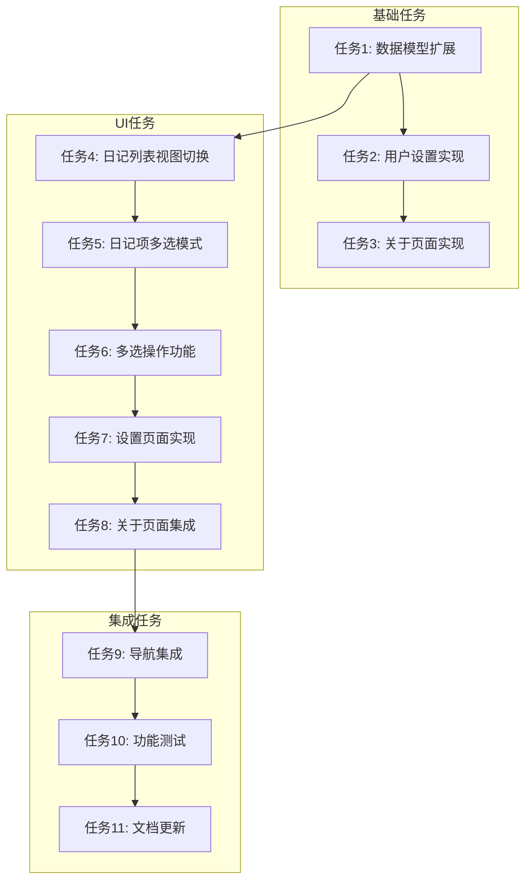

# 日记应用界面优化 - 任务拆分文档

## 任务依赖图

## 原子任务清单

### 任务1: 数据模型扩展
**优先级**: P0 - 基础依赖
**输入契约**:
- 现有Diary实体定义
- 用户设置需求

**输出契约**:
- 扩展的Diary实体，添加卡片颜色字段
- Settings数据类，包含主题、视图模式、字体大小设置
- AboutInfo数据类，包含项目信息
- 数据库迁移脚本

**实现约束**:
- 保持向后兼容
- 使用Room自动迁移
- 不删除现有字段

**验收标准**:
- [ ] 数据库升级无数据丢失
- [ ] 新字段添加成功
- - [ ] 数据类定义正确

### 任务2: 用户设置实现
**优先级**: P0
**前置任务**: 任务1

**输入契约**:
- 任务1中定义的Settings数据类
- DataStore使用规范

**输出契约**:
- SettingsRepository实现
- SettingsViewModel实现
- 用户设置保存和加载功能

**实现约束**:
- 使用DataStore持久化设置
- 使用Flow响应式查询
- 支持设置变更通知

**验收标准**:
- [ ] 设置保存功能正常
- [ ] 设置加载功能正常
- [ ] 设置变更通知正常
- [ ] 异常处理完整

### 任务3: 关于页面实现
**优先级**: P1
**前置任务**: 任务1

**输入契约**:
- 任务1中定义的AboutInfo数据类
- 资源文件中的项目信息

**输出契约**:
- AboutRepository实现
- AboutViewModel实现
- 项目信息加载功能

**实现约束**:
- 从资源文件加载信息
- 使用Flow响应式查询
- 支持信息更新

**验收标准**:
- [ ] 项目信息加载正常
- [ ] 信息展示完整
- [ ] 异常处理完整

### 任务4: 日记列表视图切换
**优先级**: P0
**前置任务**: 任务1, 任务2

**输入契约**:
- 现有DiaryListScreen组件
- 用户设置中的视图模式

**输出契约**:
- 修改后的DiaryListScreen组件
- 列表和网格两种视图模式实现
- 视图模式切换功能

**实现约束**:
- 使用Jetpack Compose实现
- 保持现有功能不变
- 遵循Material Design 3

**验收标准**:
- [ ] 列表视图正常显示
- [ ] 网格视图正常显示
- [ ] 视图切换功能正常
- [ ] 设置中的视图模式生效

### 任务5: 日记项多选模式
**优先级**: P0
**前置任务**: 任务4

**输入契约**:
- 现有DiaryItem组件
- 多选模式需求

**输出契约**:
- 修改后的DiaryItem组件
- 多选模式状态管理
- 长按进入多选模式功能

**实现约束**:
- 使用Jetpack Compose状态管理
- 支持单选和多选
- 保持现有功能不变

**验收标准**:
- [ ] 长按进入多选模式功能正常
- [ ] 多选状态显示正确
- [ ] 单选和多选切换正常
- [ ] 退出多选模式功能正常

### 任务6: 多选操作功能
**优先级**: P0
**前置任务**: 任务5

**输入契约**:
- 多选模式状态
- 多选操作需求

**输出契约**:
- 多选菜单组件
- 删除功能实现
- 卡片颜色设置功能实现
- 顶置功能实现
- 克隆功能实现
- 分享功能实现
- 标签功能实现

**实现约束**:
- 使用Jetpack Compose实现
- 支持批量操作
- 提供操作确认

**验收标准**:
- [ ] 多选菜单显示正常
- [ ] 删除功能正常
- [ ] 卡片颜色设置功能正常
- [ ] 顶置功能正常
- [ ] 克隆功能正常
- [ ] 分享功能正常
- [ ] 标签功能正常

### 任务7: 设置页面实现
**优先级**: P1
**前置任务**: 任务2

**输入契约**:
- 用户设置需求
- SettingsViewModel

**输出契约**:
- SettingsScreen组件
- 主题设置功能
- 视图设置功能
- 字体大小设置功能

**实现约束**:
- 使用Jetpack Compose实现
- 遵循Material Design 3
- 支持设置实时预览

**验收标准**:
- [ ] 设置页面显示正常
- [ ] 主题设置功能正常
- [ ] 视图设置功能正常
- [ ] 字体大小设置功能正常
- [ ] 设置保存和应用正常

### 任务8: 关于页面集成
**优先级**: P2
**前置任务**: 任务3

**输入契约**:
- AboutViewModel
- 关于页面需求

**输出契约**:
- AboutScreen组件
- 项目信息展示
- 作者信息展示
- 版本信息展示
- 联系方式展示

**实现约束**:
- 使用Jetpack Compose实现
- 遵循Material Design 3
- 支持链接点击

**验收标准**:
- [ ] 关于页面显示正常
- [ ] 项目信息展示完整
- [ ] 作者信息展示正确
- [ ] 版本信息显示正确
- [ ] 联系方式可用

### 任务9: 导航集成
**优先级**: P1
**前置任务**: 任务7, 任务8

**输入契约**:
- 现有导航结构
- 新增页面需求

**输出契约**:
- 更新后的导航图
- 设置页面导航
- 关于页面导航
- 导转动画

**实现约束**:
- 使用Navigation Component
- 保持现有导航结构
- 添加必要的转场动画

**验收标准**:
- [ ] 设置页面导航正常
- [ ] 关于页面导航正常
- [ ] 导航转场动画正常
- [ ] 返回导航正常

### 任务10: 功能测试
**优先级**: P1
**前置任务**: 任务6, 任务7, 任务8, 任务9

**输入契约**:
- 所有实现的功能
- 测试需求

**输出契约**:
- 单元测试用例
- 集成测试用例
- UI测试用例
- 测试报告

**实现约束**:
- 使用JUnit和Espresso
- 覆盖核心功能
- 测试边界条件

**验收标准**:
- [ ] 单元测试覆盖率>80%
- [ ] 集成测试通过
- [ ] UI测试通过
- [ ] 测试报告完整

### 任务11: 文档更新
**优先级**: P2
**前置任务**: 任务10

**输入契约**:
- 所有实现的功能
- 现有文档

**输出契约**:
- 更新后的README.md
- 功能使用说明
- 开发文档更新

**实现约束**:
- 文档格式统一
- 内容准确完整
- 包含示例代码

**验收标准**:
- [ ] README.md更新完整
- [ ] 功能使用说明清晰
- [ ] 开发文档更新完整
- [ ] 示例代码正确

## 任务执行顺序

1. **第一阶段**: 基础任务
   - 任务1: 数据模型扩展
   - 任务2: 用户设置实现
   - 任务3: 关于页面实现

2. **第二阶段**: UI任务
   - 任务4: 日记列表视图切换
   - 任务5: 日记项多选模式
   - 任务6: 多选操作功能
   - 任务7: 设置页面实现
   - 任务8: 关于页面集成

3. **第三阶段**: 集成任务
   - 任务9: 导航集成
   - 任务10: 功能测试
   - 任务11: 文档更新

## 任务依赖关系说明

- **数据模型扩展**是所有任务的基础，因为它提供了必要的数据结构
- **用户设置实现**依赖于数据模型扩展，因为它需要使用Settings数据类
- **关于页面实现**依赖于数据模型扩展，因为它需要使用AboutInfo数据类
- **日记列表视图切换**依赖于数据模型扩展和用户设置实现，因为它需要使用扩展的Diary实体和用户设置
- **日记项多选模式**依赖于日记列表视图切换，因为它需要在列表视图的基础上实现
- **多选操作功能**依赖于日记项多选模式，因为它需要基于多选状态实现操作
- **设置页面实现**依赖于用户设置实现，因为它需要使用SettingsViewModel
- **关于页面集成**依赖于关于页面实现，因为它需要使用AboutViewModel
- **导航集成**依赖于设置页面实现和关于页面集成，因为它需要将新页面集成到导航结构中
- **功能测试**依赖于多选操作功能、设置页面实现、关于页面集成和导航集成，因为它需要测试这些功能
- **文档更新**依赖于功能测试，因为它需要基于最终实现的功能更新文档